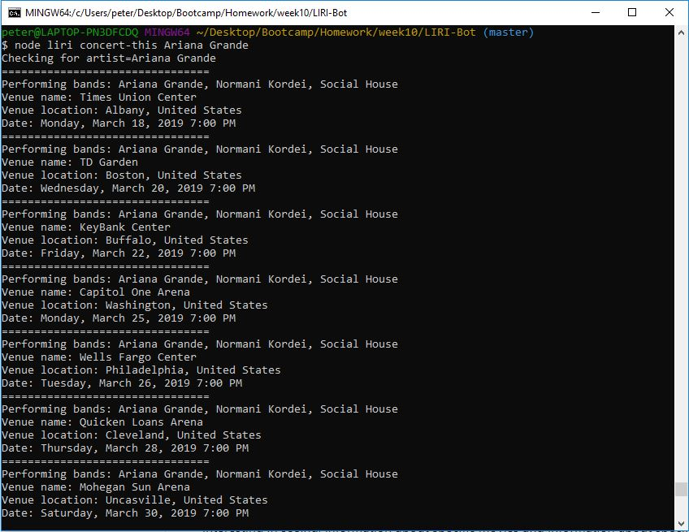
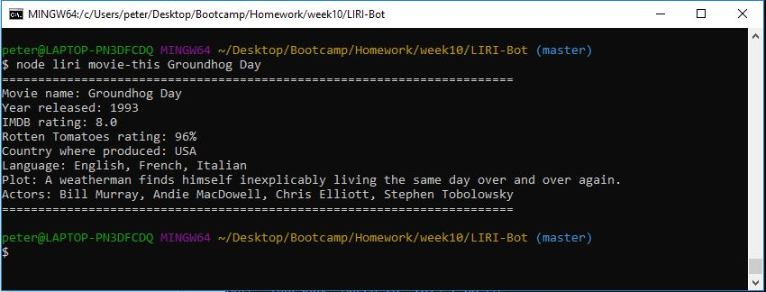
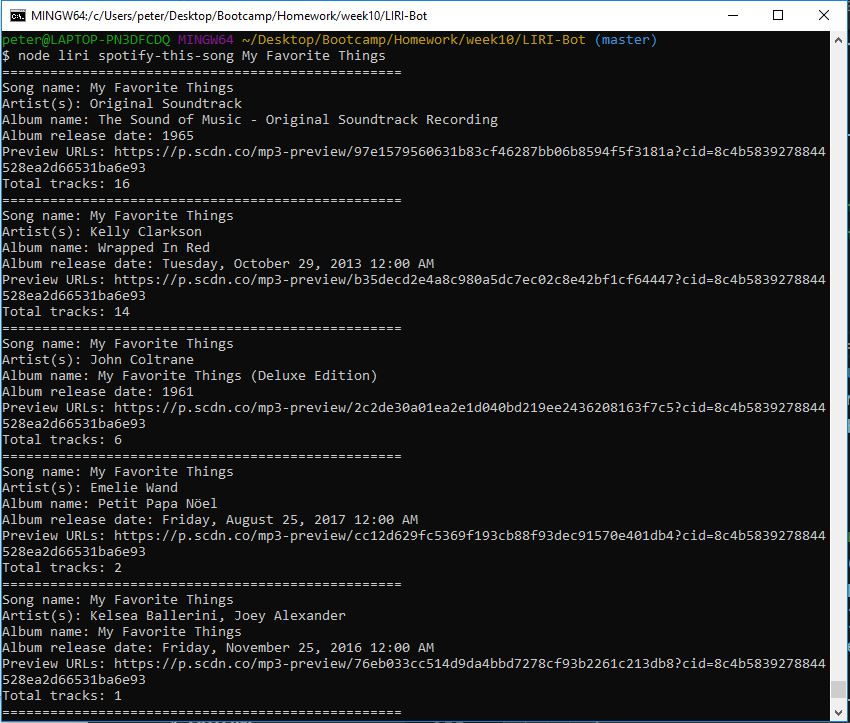
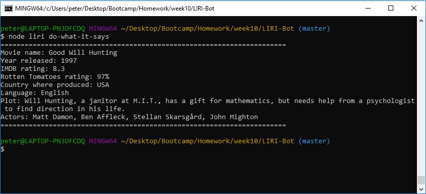

# LIRI-Bot
Week 10 homework assignment

### Overview
This project uses Node.js to create a simple language interprtation and recognition interface (LIRI) to get different types of requested information. The information is obtained using Axios and Spotify to query different URLs to get data for movies, songs and concerts. Please download the video "Mar 3, 2019 11_10 PM.webm" which is in the videos folder in my LIRI-Bot repository to actually watch the LIRI program being executed.
[LIRI video](videos/Mar 3, 2019 11_10 PM.webm)

### Purpose
The purpose of this assignment is to provide users with useful information about upcoming concert events for bands they are interesting in seeing, information about specific movies and information about specific songs.

### Getting Started
To use the LIRI created for this project, you will need to copy the package.json file for this project to your root node.js directory and install NPM packages for:
* Node-Spotify-API
* Axios
* Moment
* DotEnv

After installing these packages, copy all of the files from the repository to your node.js root node. You will be running the liri.js file in node. This file takes in the following four commands:
* concert-this
* spotify-this-song
* movie-this
* do-what-it-says

Each of these commands will be followed by an argument that will represent the "this" of the above three ...-this commands. For example, if you wanted to see all the concerts that Ariana Grande will be performing in in the future, your command line will look like this:

* $node liri concert-this Ariana Grande

Here are the results of the above concert-this query:

Likewise, to get information about a specific movie, your command line will look like this:

* $node liri movie-this Groundhog Day

Here are the results of the above movie-this query:

To get information about a specific song, your command line will look like this:

* $node liri spotify-this-song My Favorite Things

Here are the results of the above spotify-this-song query:

Finally, the do-what-it-says query does not pass a "this" argument. Rather, it reads from the file Random.txt which should be located in your root directy for this project. This file should contain a query type, e.g., spotify-this-song, and a corresponding "this" argument, e.g., Born to Run. To execute the do-what-it-says query, invoke it from the command line as follows:

* $node liri do-what-it-says

For a Random.txt file containing the following line:

movie-this, Good Will Hunting

the following output was generated:

### Outputs

The LIRI program displays query results to the terminal window. These results are also output to text files. Each query has their own separate text file:
* concert-this - Concert.txt
* spotify-this-song - Spotify.txt
* movie-this - Movie.txt

After invoking a LIRI query, open the corresponding text file to see the results that were displayed on in the terminal window.

This project is maintained by Peter Tag
